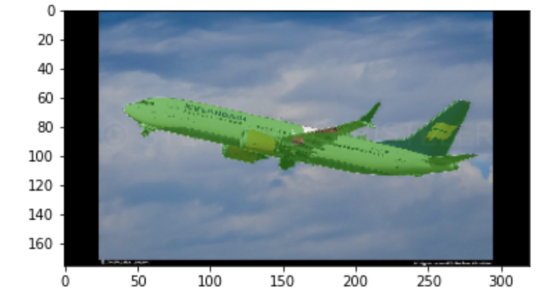

# Airplane image segmentation

Using PSP-Net for image segmentation, especially for airplane segmentation.

The base contains original images:

and segmented images:

Results after trainig:

Let's add mask on original image for better look:

